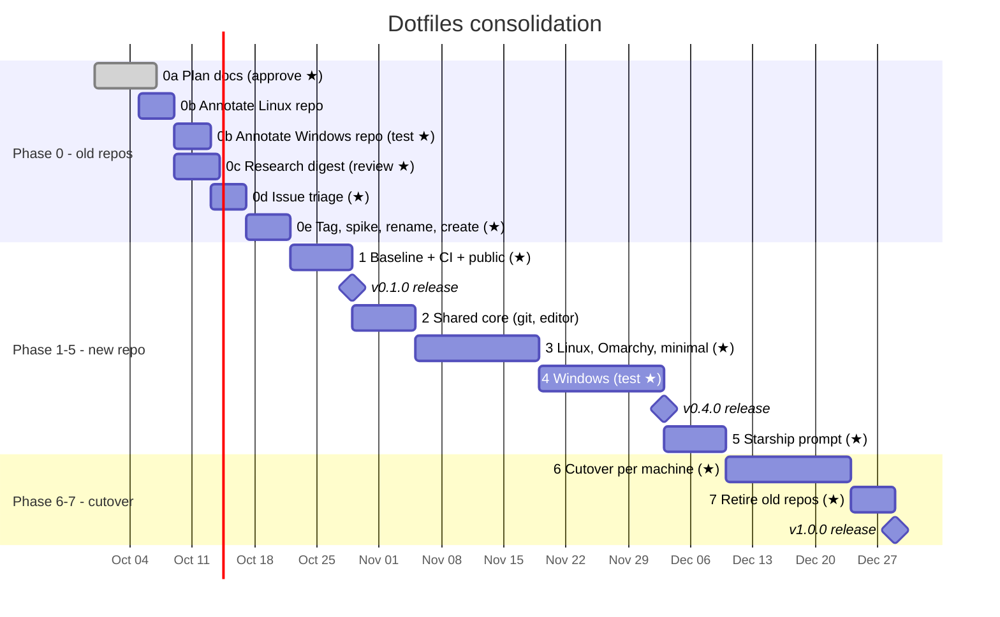

# Schedule

A projected timeline at hobby pace: about 2–3 short sessions a week, starting the week
of 2026-10-05. Dates are targets, not deadlines. If a phase slips, later phases slip
with it; don't compress a phase to catch up.

★ marks the steps that need Sean. Agents cannot do these alone: approvals, GitHub
settings, and anything run on real hardware.

## Timeline

## By week

| Week of | Phase | Agent work | ★ Sean |
|---|---|---|---|
| 2026-10-05 | 0a, 0b | Annotate the Linux repo (`CONTENTS.md`, header comments) | Approve the plan; review the annotation PR |
| 2026-10-12 | 0b, 0c | Annotate the Windows repo; research digest | Run `Test-Dotfiles.ps1` on Windows; review the digest |
| 2026-10-19 | 0d, 0e | Triage tables; spike instructions | Close/label issues; tag baselines; run the chezmoi spike on WSL + Windows; repoint remotes; rename + create the repo |
| 2026-10-26 | 1 | Snapshot, scaffolding, CI, audit | Audit sign-off; make the repo public; publish v0.1.0 |
| 2026-11-02 | 2 | chezmoi skeleton, `.gitconfig` template, editor | Gate review |
| 2026-11-09 → 11-16 | 3 | zsh/bash, packages, `upgrade`, Omarchy hook, `minimal` | Run the OMZ usage script; test on Omarchy and a throwaway LXC |
| 2026-11-23 → 11-30 | 4 | PowerShell profile, loaders, WT merge, winget, `upgrade` | Test on a Windows host (a spare user profile or VM first); publish v0.4.0 |
| 2026-12-07 | 5 | Starship config | Look-and-feel sign-off |
| 2026-12-14 → 12-21 | 6 | Cutover checklists, vault link rewrites | Run each cutover: WSL → Omarchy → Windows → one Proxmox guest |
| 2027-01-04 | 7 | Remove `legacy/`, final docs | Archive the old repos; publish v1.0.0 |

Holiday weeks are expected to slip. The plan has no hard dependency on dates.

## Milestones

| Milestone | Target | Meaning |
|---|---|---|
| `pre-merge-baseline` (tag on the old repos) | ~2026-10-23 | The last state of each old repo before the merge |
| **v0.1.0 Baseline** (release) | ~2026-10-30 | New repo public, snapshot captured, CI green |
| v0.2.0 (tag) | ~2026-11-06 | Shared git/editor config works via chezmoi |
| v0.3.0 (tag) | ~2026-11-20 | Linux, WSL, Omarchy and `minimal` work in test |
| **v0.4.0 All platforms** (release) | ~2026-12-04 | Windows works in test too |
| v0.5.0 (tag) | ~2026-12-11 | Starship everywhere |
| **v1.0.0 Single repo** (release) | ~2027-01-08 | All machines migrated, old repos archived |
